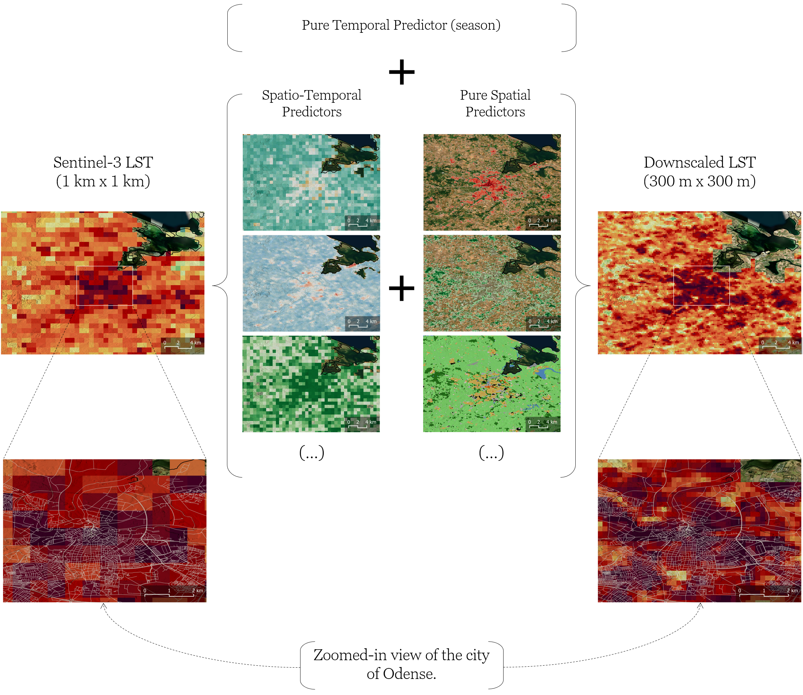

# **s3lst-ds**: a package for downscaling Sentinel-3 LST data using a scale-invariance-based model

<!-- Badges from [Shields.io](https://shields.io/badges) -->

<!-- ----------------------------- PyPI badges ----------------------------- -->
<!-- NOTE: the values of all PyPI badges are inferred from the PyPI website dedicated
to the project. All PyPI-related badges may be found
[here](https://shields.io/search/?q=pypi)-->
<!-- Packge version: https://shields.io/badges/py-pi-version -->
<!-- Pakage python version: https://shields.io/badges/py-pi-python-version -->
<!-- Package license: https://shields.io/badges/py-pi-license -->
<!-- Package implementation: https://shields.io/badges/py-pi-implementation -->
<!-- Package indicator for availability of wheel distribution : https://shields.io/badges/py-pi-wheel -->
<!-- Package development status: https://shields.io/badges/py-pi-status -->

<!-- ---------------------------- GitHub badges ---------------------------- -->
<!-- NOTE: the values of all GitHub badges are inferred from the GitHub repo of the
project. All GitHub-related badges may be found
[here](https://shields.io/search/?q=github)-->

<!-- GitHub time of last commit: https://shields.io/badges/git-hub-last-commit -->

<!-- ---------------------------- Other badges ----------------------------- -->
<!-- pre-commit usag: https://pre-commit.com/#badging-your-repository -->
<!-- uv package and project manager usage: https://github.com/astral-sh/uv/pull/15075#issue-3291641128 -->
<!-- Ruff linter and formatter usage: https://github.com/astral-sh/ruff/blob/main/README.md?plain=1 -->
<!-- Hatch build backend usage: https://hatch.pypa.io/dev/next-steps/#community -->


[](https://github.com/pre-commit/pre-commit)
[](https://github.com/astral-sh/uv)
[](https://github.com/astral-sh/ruff)
[](https://github.com/pypa/hatch)

[s3lst-ds](https://github.com/CoLAB-ATLANTIC/s3lst-ds) provides pipelines for
conveniently querying, downloading, filtering and downscaling [Sentinel-3
LST](https://sentiwiki.copernicus.eu/web/slstr-products#L2-LST-Products) data using
either single or multi-timestamp scale-invariance-based models.

<p>
    
</p>

## Requirements

To be able to install and use the [s3lst-ds](https://github.com/CoLAB-ATLANTIC/s3lst-ds)
package in your project, you would need:

* An [Unix](https://en.wikipedia.org/wiki/Unix)-like environment.
* [`uv`](https://docs.astral.sh/uv/) project manager.
* A [CDSE](https://dataspace.copernicus.eu/) account.

## Installation

### 1. Install package from PyPI

* Install the latest stable release from [PyPI](https://pypi.org/project/s3lst-ds/) in
the activated virtual environment using [`uv`](https://docs.astral.sh/uv/):

    ```bash
    uv add s3lst-ds
    ```

### 2. Set CDSE credentials

* Safely set your [CDSE](https://dataspace.copernicus.eu/) credentials as environment
  variables of the system:

    ```bash
    uv run s3lst-ds-set-cdse
    ```

### 3. Install [`esa-snappy`](https://github.com/senbox-org/esa-snappy) (optional)

* Install [`esa-snappy`](https://github.com/senbox-org/esa-snappy) Python package using
  `uv`:

    ```bash
    uv add s3lst-ds[snap]
    ```

* Install the backend [`SNAP`](https://earth.esa.int/eogateway/tools/snap) Java
   package and subsequently configure it using `uv`:

    ```bash
    uv run s3lst-ds-install-snap
    ```

> [!NOTE]
> #### CDSE credentials
> CDSE credentials are required to download Sentinel-3 data. Script
> `s3lst-ds-set-cdse` will prompt you to provide their CDSE mail and password.
> The script will subsequently write them to file `~/.config/cdse_credentials.sh`
> with user-only read and write permissions and source it in `~/.bashrc` file. You
> may check the created credentials file using the command:
>
> ```bash
> nano ~/.config/cdse_credentials.sh
> ```
>
> Note that if you would like to remove the credentials from the file at a later
> time, you may run:
>
> ```bash
> uv run s3lst-ds-unset-cdse
> ```
>
> #### Better downscaling results may be obtained with `esa-snappy`
> The default installation considers
> [`rioxarray`](https://corteva.github.io/rioxarray/stable/) for georeferencing the
> downloaded Sentinel-3 products. However,
> [`esa-snappy`](https://github.com/senbox-org/esa-snappy) has been found to produce better
> results, and, because of that, it is herein availed as an optional tool. With its
> installation, both tools can be used for georeferencing.
>
> #### Uninstall `SNAP`
> If the you would to like to uninstall `SNAP` at a later time, you may run:
> 
> ```bash
> uv run s3lst-ds-uninstall-snap
> ```

> [!WARNING]
> #### `SNAP`'s memory limit
> It is important to note that `SNAP` is configured with a limited amount of memory. To
> increase `SNAP`'s maximum heap memory to for instance `64 GB`, you would need to open file
> `esa_snappy.ini` nested in the installation directory of the virtual environment
> (herein assumed to be `VENV`) by doing 
>
> ```bash
> nano VENV/lib/python3.12/site-packages/esa_snappy/esa_snappy.ini
> ```
> and writing in it:
>
> ```ini
> [DEFAULT]
> java_max_mem: 64G
> ```


## Documentation

To be built.

## Contributing

If you are a project developer, please read
[CONTRIBUTING.md](https://github.com/CoLAB-ATLANTIC/s3lst-ds/blob/main/CONTRIBUTING.md)
to assimilate the development workflow, build Docker images from the project source code
and locally run them.

## Releasing

If you are a project maintainer, please read
[RELEASING.md](https://github.com/CoLAB-ATLANTIC/s3lst-ds/blob/main/RELEASING.md) to
know how to build and publish the package to [PyPI](https://pypi.org/) and to create
[GitHub
releases](https://docs.github.com/en/repositories/releasing-projects-on-github/managing-releases-in-a-repository)
after successful merge pull requests.

## Citation

If you use `s3lst-ds` in research or software, please cite the [companion
paper](https://www.mdpi.com/2072-4292/18/13/2263). The respective citation information
is provided in [`CITATION.cff`](https://github.com/CoLAB-ATLANTIC/s3lst-ds/blob/main/CITATION.cff)
and may be download in APA or BibTeX formats through button `Cite this repository` in
the `About` section of the [GitHub repo
page](https://github.com/CoLAB-ATLANTIC/s3lst-ds).

## License

`s3lst-ds` is licensed under the terms of the [MIT
license](https://github.com/CoLAB-ATLANTIC/s3lst-ds/blob/main/LICENSE). 