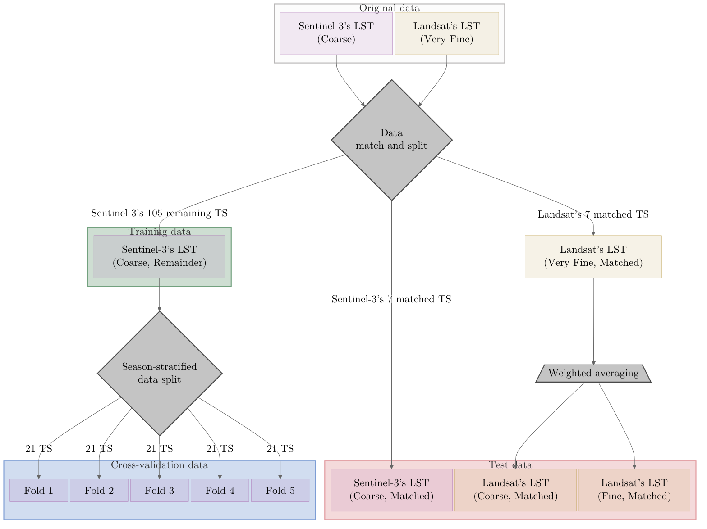

```mermaid
%% Theme
%%{init: {"theme": "neutral", "flowchart": {"nodeSpacing": 5, "rankSpacing": 35}, "themeVariables": {"fontSize": "18px"}}}%%

flowchart TD

    lst_sentinel --> splitter -->|"$$\text{Sentinel-3's }105\text{ remaining TS}$$"| lst_sentinel_coarse_train

    lst_sentinel_coarse_train --> splitter_2 
    splitter_2 -->|"$$21\text{ TS}$$"| lst_sentinel_coarse_cross_val_fold_1
    splitter_2 -->|"$$21\text{ TS}$$"| lst_sentinel_coarse_cross_val_fold_2
    splitter_2 -->|"$$21\text{ TS}$$"| lst_sentinel_coarse_cross_val_fold_3
    splitter_2 -->|"$$21\text{ TS}$$"| lst_sentinel_coarse_cross_val_fold_4
    splitter_2 -->|"$$21\text{ TS}$$"| lst_sentinel_coarse_cross_val_fold_5

    splitter -->|"$$\text{Sentinel-3's } 7\text{ matched TS}$$"| lst_sentinel_coarse_test
    lst_landsat --> splitter -->|"$$\text{Landsat's } 7\text{ matched TS}$$"| lst_landsat_match
    lst_landsat_match --> interp_coarse --> lst_landsat_coarse_test
    interp_coarse --> lst_landsat_fine_test
    

    subgraph original_subgraph["$$\text{Original data}$$"]
        lst_sentinel
        lst_landsat
    end


    subgraph data_train_subgraph["$$\text{Training data}$$"]
        lst_sentinel_coarse_train
    end

    subgraph data_test_subgraph["$$\text{Test data}$$"]
        lst_sentinel_coarse_test
        lst_landsat_coarse_test
        lst_landsat_fine_test
    end

    subgraph data_cross_val_subgraph["$$\text{Cross-validation data}$$"]
        lst_sentinel_coarse_cross_val_fold_1
        lst_sentinel_coarse_cross_val_fold_2
        lst_sentinel_coarse_cross_val_fold_3
        lst_sentinel_coarse_cross_val_fold_4
        lst_sentinel_coarse_cross_val_fold_5
    end

    %% Shapes and labels
    lst_sentinel["$$\begin{align*}\text{Sentinel-3's }\mathrm{LST} \\\\ \text{(Coarse)} \end{align*}$$"]
    lst_sentinel_coarse_train["$$\begin{align*}\text{Sentinel-3's }\mathrm{LST} \\\\ \text{(Coarse, Remainder)} \end{align*}$$"]
    lst_sentinel_coarse_test["$$\begin{align*}\text{Sentinel-3's }\mathrm{LST} \\\\ \text{(Coarse, Matched)} \end{align*}$$"]
    lst_landsat["$$\begin{align*}\text{Landsat's }\mathrm{LST} \\\\ \text{(Very Fine)} \end{align*}$$"]
    lst_landsat_match["$$\begin{align*}\text{Landsat's }\mathrm{LST} \\\\ \text{(Very Fine, Matched)} \end{align*}$$"]
    lst_landsat_coarse_test["$$\begin{align*}\text{Landsat's }\mathrm{LST} \\\\ \text{(Coarse, Matched)} \end{align*}$$"]
    lst_landsat_fine_test["$$\begin{align*}\text{Landsat's }\mathrm{LST} \\\\ \text{(Fine, Matched)} \end{align*}$$"]
    splitter{"$$\begin{align*}\text{Data} \\\\ \text{match and split} \end{align*}$$"}
    splitter_2{"$$\begin{align*}\text{Season-stratified} \\\\ \text{data split} \end{align*}$$"}
    interp_coarse["$$\text{Weighted averaging}$$"]@{ shape: trap-b}
    lst_sentinel_coarse_cross_val_fold_1["$$\text{Fold 1}$$"]
    lst_sentinel_coarse_cross_val_fold_2["$$\text{Fold 2}$$"]
    lst_sentinel_coarse_cross_val_fold_3["$$\text{Fold 3}$$"]
    lst_sentinel_coarse_cross_val_fold_4["$$\text{Fold 4}$$"]
    lst_sentinel_coarse_cross_val_fold_5["$$\text{Fold 5}$$"]

    %% Styling
    style lst_sentinel fill:#ad76b5,fill-opacity:0.15,stroke:#ad76b5,stroke-width:0.5px
    style lst_sentinel_coarse_train fill:#ad76b5,fill-opacity:0.15,stroke:#ad76b5,stroke-width:0.5px
    style lst_sentinel_coarse_test fill:#ad76b5,fill-opacity:0.15,stroke:#ad76b5,stroke-width:0.5px
    style lst_landsat fill:#c2a75d,fill-opacity:0.15,stroke:#c2a75d,stroke-width:0.5px
    style lst_landsat_match fill:#c2a75d,fill-opacity:0.15,stroke:#c2a75d,stroke-width:0.5px
    style lst_landsat_coarse_test fill:#c2a75d,fill-opacity:0.15,stroke:#c2a75d,stroke-width:0.5px
    style lst_landsat_fine_test fill:#c2a75d,fill-opacity:0.15,stroke:#c2a75d,stroke-width:0.5px
    style lst_sentinel_coarse_cross_val_fold_1 fill:#ad76b5,fill-opacity:0.15,stroke:#ad76b5,stroke-width:0.5px
    style lst_sentinel_coarse_cross_val_fold_2 fill:#ad76b5,fill-opacity:0.15,stroke:#ad76b5,stroke-width:0.5px
    style lst_sentinel_coarse_cross_val_fold_3 fill:#ad76b5,fill-opacity:0.15,stroke:#ad76b5,stroke-width:0.5px
    style lst_sentinel_coarse_cross_val_fold_4 fill:#ad76b5,fill-opacity:0.15,stroke:#ad76b5,stroke-width:0.5px
    style lst_sentinel_coarse_cross_val_fold_5 fill:#ad76b5,fill-opacity:0.15,stroke:#ad76b5,stroke-width:0.5px
    style original_subgraph fill:#f7f7f7,fill-opacity:0.35,stroke:#b8b6b6,stroke-width:2px
    style data_train_subgraph fill:#72a17e,fill-opacity:0.35,stroke:#72a17e,stroke-width:2px
    style data_test_subgraph fill:#e09499,fill-opacity:0.35,stroke:#e09499,stroke-width:2px
    style data_cross_val_subgraph fill:#7d9dd4,fill-opacity:0.35,stroke:#7d9dd4,stroke-width:2px
    style splitter fill:#c4c4c4,stroke:#4A4A4A,stroke-width:2px
    style splitter_2 fill:#c4c4c4,stroke:#4A4A4A,stroke-width:2px
    style interp_coarse fill:#c4c4c4,stroke:#4A4A4A,stroke-width:2px
```

