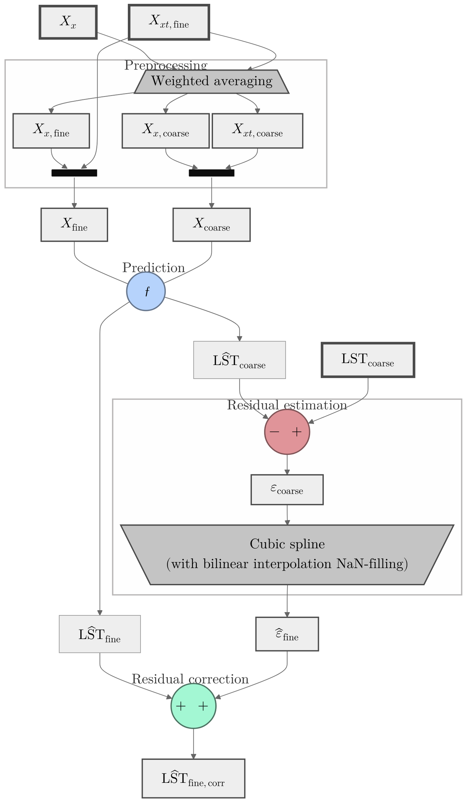

```mermaid
%% Theme
%%{init: {"theme": "neutral", "flowchart": {"nodeSpacing": 5, "rankSpacing": 32}, "themeVariables": {"fontSize": "18px"}}}%%

flowchart TD
    
    X_x --> interp_coarse_X_xt_X_x --> X_x_fine --> bus_X_fine --> X_fine --> f --> LST_fine_pred --> add --> LST_fine_pred_corr

    interp_coarse_X_xt_X_x --> X_x_coarse --> bus_X_coarse --> X_coarse --> f --> LST_coarse_pred --> subtract --> res_coarse --> interp_fine_res --> res_fine_pred --> add

    X_xt_fine --> bus_X_fine


    X_xt_fine --> interp_coarse_X_xt_X_x --> X_xt_coarse --> bus_X_coarse


    LST_coarse --> subtract

    subgraph res_estimation["$$\text{Residual estimation}$$"]
        subtract
        res_coarse
        interp_fine_res
    end

    subgraph preprocessing["$$\text{Preprocessing}$$"]
        X_x_coarse
        X_xt_coarse
        X_x_fine
        interp_coarse_X_xt_X_x
        bus_X_coarse
        bus_X_fine
    end

    subgraph prediction["$$\text{Prediction}$$"]
        f
    end

    subgraph res_corr["$$\text{Residual correction}$$"]
        add
    end

    %% Shapes and labels
    X_x["$$X_x$$"]
    X_x_coarse["$$X_{x,\mathrm{coarse}}$$"]
    X_x_fine["$$X_{x,\mathrm{fine}}$$"]
    X_xt_coarse["$$X_{xt,\mathrm{coarse}}$$"]
    X_xt_fine["$$X_{xt,\mathrm{fine}}$$"]
    X_coarse["$$X_{\mathrm{coarse}}$$"]
    X_fine["$$X_{\mathrm{fine}}$$"]
    LST_coarse["$$\mathrm{LST}_{\mathrm{coarse}}$$"]
    LST_coarse_pred["$$\hat{\mathrm{LST}}_{\mathrm{coarse}}$$"]
    LST_fine_pred["$$\hat{\mathrm{LST}}_{\mathrm{fine}}$$"]
    LST_fine_pred_corr["$$\hat{\mathrm{LST}}_{\mathrm{fine},\mathrm{corr}}$$"]
    res_coarse["$$\varepsilon_{\mathrm{coarse}}$$"]
    res_fine_pred["$$\hat{\varepsilon}_{\mathrm{fine}}$$"]
    f(("$$f$$"))
    add(("$$+\,\,\,+$$"))
    subtract(("$$-\,\,\,+$$"))
    interp_coarse_X_xt_X_x["$$\text{Weighted averaging}$$"]@{ shape: trap-b}
    interp_fine_res["$$\begin{align*}\text{Cubic spline} \\\\ \text{(with bilinear interpolation NaN-filling)}\end{align*}$$"]@{ shape: trap-t}
    bus_X_coarse@{shape: fork}
    bus_X_fine@{shape: fork}

    %% Styling
    style X_x stroke:#4A4A4A,stroke-width:4px
    style X_x_coarse stroke:#4A4A4A,stroke-width:2px
    style X_x_fine stroke:#4A4A4A,stroke-width:2px
    style X_xt_coarse stroke:#4A4A4A,stroke-width:2px
    style X_xt_fine stroke:#4A4A4A,stroke-width:4px
    style X_x_fine stroke:#4A4A4A,stroke-width:2px
    style X_coarse stroke:#4A4A4A,stroke-width:2px
    style X_fine stroke:#4A4A4A,stroke-width:2px
    style LST_coarse stroke:#4A4A4A,stroke-width:4px
    style LST_fine_pred_corr stroke:#4A4A4A,stroke-width:2px
    style res_coarse stroke:#4A4A4A,stroke-width:2px
    style res_fine_pred stroke:#4A4A4A,stroke-width:2px
    style f fill:#B6D3FC,stroke:#65758c,stroke-width:2px,r:30px
    style add fill:#A3F7D3,stroke:#4d7363,stroke-width:2px,r:35px
    style subtract fill:#e09499,stroke:#805457,stroke-width:2px,r:35px
    style interp_coarse_X_xt_X_x fill:#c4c4c4,stroke:#4A4A4A,stroke-width:2px
    style interp_fine_res fill:#c4c4c4,stroke:#4A4A4A,stroke-width:2px
    style preprocessing fill:#f7f7f7,fill-opacity:0.15,stroke:#b8b6b6,stroke-width:2px
    style prediction fill-opacity:0,stroke-width:0px
    style res_estimation fill:#f7f7f7,fill-opacity:0.15,stroke:#b8b6b6,stroke-width:2px
    style res_corr fill-opacity:0,stroke-width:0px
    style bus_X_coarse fill:#0d0d0d,stroke:#0d0d0d
    style bus_X_fine fill:#0d0d0d,stroke:#0d0d0d
```

